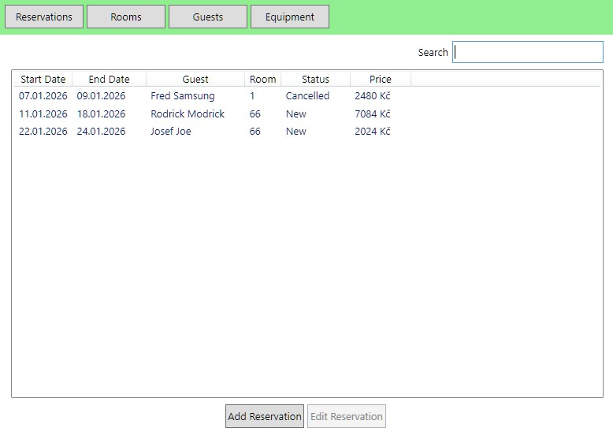

## About App

This is a very simple small hotel database program, able to store data about reservations, guests, rooms and equipment.

*Reservation view*

## How to launch

1. Download the latest release from [Releases](https://github.com/WaluigiNumber8/seyfor-database-project/releases).
2. Extract from ZIP.
3. Launch _Seyfor Database Project.exe_.
4. The app should open with an empty database.

## How to get project for development

1. Clone Github Repo.
2. Open folder with *SeyforDatabaseProject.sln* in your IDE.
3. No further configuration should be needed. Press Play to launch configuration (SeyforDatabaseProject.View).

## Architecture

The app's architecture is split into 3 layers using the **MVVM pattern**. Each layer is a separate cs project. 
The layers are:

- **Model** 
  - Contains data processing and database access.
  - Uses SQLite as the database.
  - Uses Entity Framework to communcate with the database.
- **ViewModel**
  - Adds UI functionality and links it model.
  - Triggers functionality via Commands. 
  - Handles data validations.
- **View**
  - Presents the user interface.
  - Uses WPF for UI.
  - Uses .NET Generic Host to setup global dependency injection.
  - Properties from View Models get binded to UI elements.
  - The app is launched from here (*App.xaml.cs*).

## Most Important Systems

In my opinion the most important systems are:

- **Model - Database Services**
  - The HotelBook.cs is the one-stop-gap for all interactions with the database (CRUD).
  - It is the main entry point into the Model Layer.
  - Thanks to generics, it allows working with any type of database item. It is only required to setup special behaviour for item types in the service classes themselves.
- **ViewModel - ScreenItemOperationsBase**
  - A container for both listing & edit screens for a given item.
  - Extending from this class allows easy addition of new item types.
  - Concrete VMs of this screen get created by Generic Host in *HostBuilderExtensions.cs*.

## Needed Improvements

If I had more time, there are plenty more things I would add/fix.

- Changing of room data doesnt reflect in reservations.
- It is not possible to clear equipment from a room.
- Add Unit Testing.
- Add Logging.
- Refactor a lot of View layer code.
- Improve UI Design (screen real estate is poorly utilized. Lack of info from UI.)
- Refactor Database service code (uses switch cases which bloat methods).

